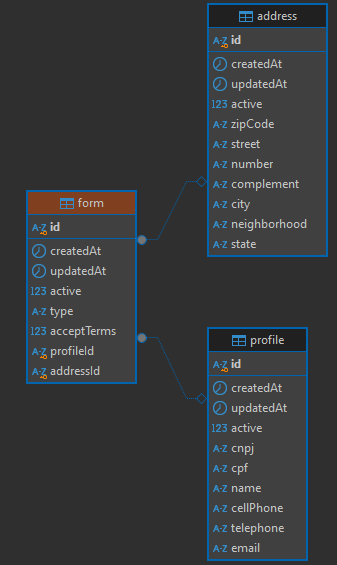

<p align="center">**BACKEND FOR FORM SUBMISSION WITH VALIDATION**.</p>

## Description

This backend application is built with Node.js and [NestJS](https://github.com/nestjs/nest), designed to handle form submissions with extensive validation for CPF/CNPJ, cell phone numbers, and other required fields. The project includes database integration with MySQL, automatic Swagger documentation, and comprehensive test coverage.

## Features

- Form creation with validation for CPF and CNPJ uniqueness in the database.
- Cell phone number validation with proper formatting.
- Conditional validations based on the form type (Individual or LegalPerson).
- API documentation via Swagger.
- Unit tests with Jest for service and validation logic.

## Prerequisites

- **Node.js** (v14+)
- **MySQL** (via Docker or local installation)
- **Yarn**

## Installation

1. Clone the repository.
2. Install dependencies:

```bash
$ yarn install```

## Environment Configuration
This project includes a pre-configured Docker setup for running MySQL. If you wish to customize the MySQL configuration, you can modify the docker-compose.yml file.

To use the existing Docker, configure your environment variables in the .env file and run the following command:

```bash
$ docker-compose up -d
```
Create a **.env** file in the root of the project with the following variables:
```bash
# Database configuration
TYPEORM_HOST=localhost
TYPEORM_PORT=3306
TYPEORM_USERNAME=root
TYPEORM_PASSWORD=yourpassword
TYPEORM_DATABASE=yourdatabase

# Docker MySQL settings
MYSQLDB_PASSWORD=password
MYSQLDB_PORT=3306
MYSQLDB_DATABASE=mysql
```

## Running the app

```bash
# development
$ yarn start

# watch mode
$ yarn dev

# production mode
$ yarn start:prod
```

## Test

```bash
$ yarn run test
```

## Database Relations
<p align="center">

</p>

## Support
Please contact [Yuri Mancini](https://github.com/YMdv) for further support.

## Stay in touch

- Website - [Indisponivel no momento](https://github.com/YMdv)
- Facebook- [Indisponivel no momento](https://github.com/YMdv)

## License

UNLICENSED.
